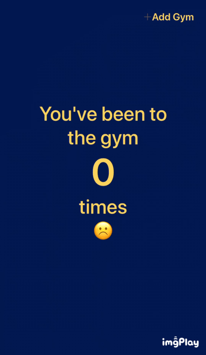

# GymStreak
Sample app that uses the Foursquare Geofencing API and Pilgrim SDK to help you keep track of how many times you've gone to the gym.

# Installation
1) Sign up for a [Foursquare Developer Account](https://foursquare.com/developers/signup)
2) Create an app
3) Clone or download the project
4) Replace the clientId, clientSecret and callback in the K.swift file with your app's own
5) Build and run!
